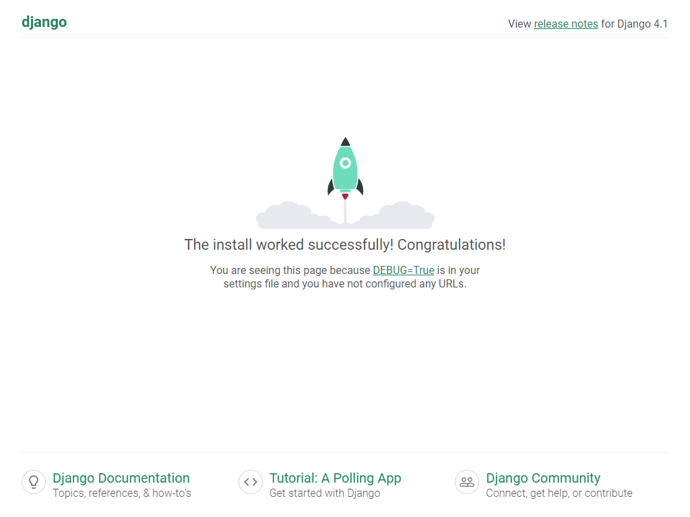
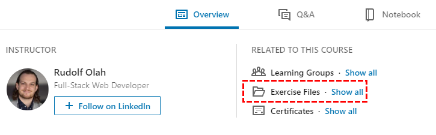
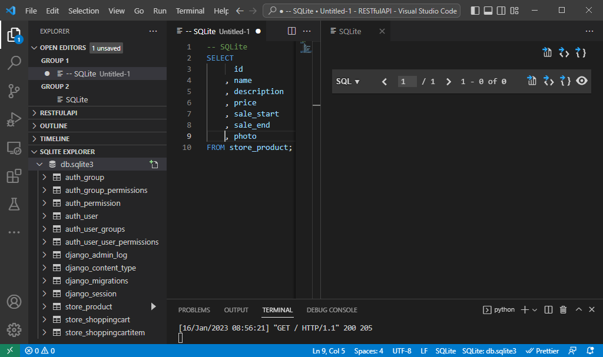
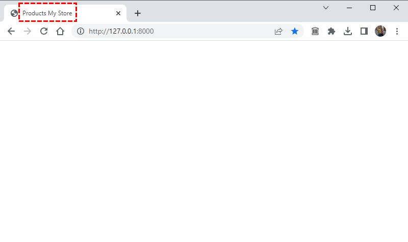
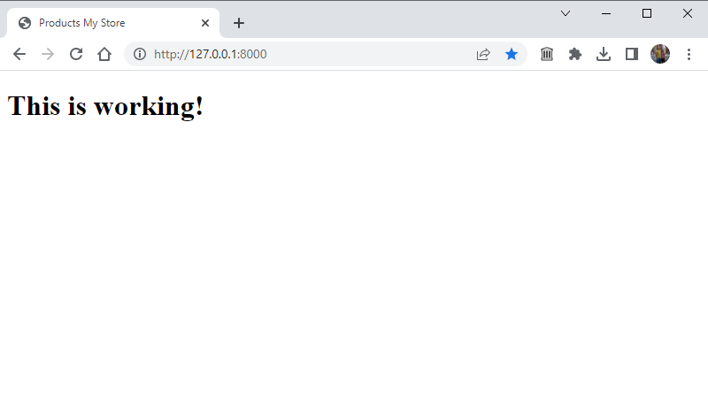
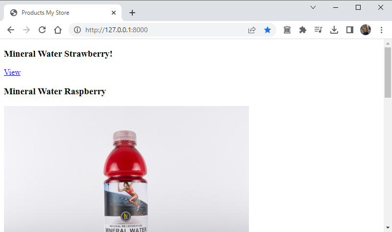

# Notes for LinkedIn Learning course "Building RESTful Web APIs with Django"

I created these instructions because the course [Building RESTful Web APIs with Django](https://www.linkedin.com/learning/building-restful-web-apis-with-django) came with lots of example files, but without any instructions on how to properly set up the environment to use those files.

These instructions are written specifically for a Windows installation, although users of other platforms may be able to use most of what I wrote.

I also set up my Django installation within a Python virtual enviroment, but did not use Anaconda, unlike what I believe the author of the course did.

My instructions make assumptions about where you choose to install Python (if not already installed), and where you choose to create your project folder.

With these caveats in mind, the following are the steps I followed.

## Setup instructions

1. Make sure latest version of Python is downloaded from https://www.python.org/downloads/

2. Install for all users in C:\Python311\ and update `PATH` using the Windows Command button + R and executing the command `SystemPropertiesAdvanced.exe`

3. Confirm that the environment variables `PATH` and `PYTHONPATH` are pointing to the latest Python version and no other path pointers exist to older versions

4. Open command prompt in Administrator mode

5. Confirm installation
```
C:\WINDOWS\system32>where python
C:\Python311\python.exe
C:\Python39\python.exe
```

6. Confirm version:
```
C:\WINDOWS\system32>python --version
Python 3.11.1
```

7. Navigate to the directory where your Python was installed
```
C:\WINDOWS\system32>cd C:\Python311
```

8. If the folder does not contain a pip.exe file, download it from https://bootstrap.pypa.io/get-pip.py and then execute the command
```
C:\Python311>py get-pip.py
Collecting pip
  Downloading pip-22.3.1-py3-none-any.whl (2.1 MB)
     ---------------------------------------- 2.1/2.1 MB 32.9 MB/s eta 0:00:00
Collecting setuptools
  Downloading setuptools-65.6.3-py3-none-any.whl (1.2 MB)
     ---------------------------------------- 1.2/1.2 MB 38.2 MB/s eta 0:00:00
Collecting wheel
  Downloading wheel-0.38.4-py3-none-any.whl (36 kB)
Installing collected packages: wheel, setuptools, pip
Successfully installed pip-22.3.1 setuptools-65.6.3 wheel-0.38.4
```

9. Navigate to directory where virtual environment will be created
```
C:\Python311>e:

E:\>cd Django
```

10. Ensure virtualenv exists in your new Python installation
```
E:\Django>pip install virtualenv -t c:\python311\lib\site-packages
Collecting virtualenv
  Using cached virtualenv-20.17.1-py3-none-any.whl (8.8 MB)
Collecting platformdirs<3,>=2.4
  Using cached platformdirs-2.6.2-py3-none-any.whl (14 kB)
Collecting filelock<4,>=3.4.1
  Using cached filelock-3.9.0-py3-none-any.whl (9.7 kB)
Collecting distlib<1,>=0.3.6
  Using cached distlib-0.3.6-py2.py3-none-any.whl (468 kB)
Installing collected packages: platformdirs, filelock, distlib, virtualenv
Successfully installed distlib-0.3.6 filelock-3.9.0 platformdirs-2.6.2 virtualenv-20.17.1
```

11. Make sure packages were installed
```
E:\Django>dir C:\Python311\Lib\site-packages
```

12. Create virtualenv for Django
```
E:\Django>python -m venv RESTfulAPI
```

13. Activate the new virtual environment
```
E:\Django>django415\Scripts\activate.bat
```

14. Install Django into the new virtual environment
```
(RESTfulAPI) E:\Django>pip install Django==4.1.5
Collecting Django==4.1.5
  Using cached Django-4.1.5-py3-none-any.whl (8.1 MB)
Collecting asgiref<4,>=3.5.2
  Using cached asgiref-3.6.0-py3-none-any.whl (23 kB)
Collecting sqlparse>=0.2.2
  Using cached sqlparse-0.4.3-py3-none-any.whl (42 kB)
Collecting tzdata
  Using cached tzdata-2022.7-py2.py3-none-any.whl (340 kB)
Installing collected packages: tzdata, sqlparse, asgiref, Django
Successfully installed Django-4.1.5 asgiref-3.6.0 sqlparse-0.4.3 tzdata-2022.7
```

15. Since we will be using Django as an API server for either angular or react, we also need to install the Django REST Framework
```
(RESTfulAPI) E:\Django>pip install djangorestframework --upgrade
Collecting djangorestframework
  Downloading djangorestframework-3.14.0-py3-none-any.whl (1.1 MB)
     ---------------------------------------- 1.1/1.1 MB 11.2 MB/s eta 0:00:00
Requirement already satisfied: django>=3.0 in e:\django\restfulapi\lib\site-packages (from djangorestframework) (4.1.5)
Requirement already satisfied: pytz in c:\python311\lib\site-packages (from djangorestframework) (2022.7)
Requirement already satisfied: asgiref<4,>=3.5.2 in e:\django\restfulapi\lib\site-packages (from django>=3.0->djangorestframework) (3.6.0)
Requirement already satisfied: sqlparse>=0.2.2 in e:\django\restfulapi\lib\site-packages (from django>=3.0->djangorestframework) (0.4.3)
Requirement already satisfied: tzdata in e:\django\restfulapi\lib\site-packages (from django>=3.0->djangorestframework) (2022.7)
Installing collected packages: djangorestframework
Successfully installed djangorestframework-3.14.0
```

16. We also need to install django-filter
```
(RESTfulAPI) E:\Django\RESTfulAPI>pip install django-filter
Collecting django-filter
  Downloading django_filter-22.1-py3-none-any.whl (80 kB)
     ---------------------------------------- 80.9/80.9 kB 4.4 MB/s eta 0:00:00
Requirement already satisfied: Django>=3.2 in e:\django\restfulapi\lib\site-packages (from django-filter) (4.1.5)
Requirement already satisfied: asgiref<4,>=3.5.2 in e:\django\restfulapi\lib\site-packages (from Django>=3.2->django-filter) (3.6.0)
Requirement already satisfied: sqlparse>=0.2.2 in e:\django\restfulapi\lib\site-packages (from Django>=3.2->django-filter) (0.4.3)
Requirement already satisfied: tzdata in e:\django\restfulapi\lib\site-packages (from Django>=3.2->django-filter) (2022.7)
Installing collected packages: django-filter
Successfully installed django-filter-22.1
```

17. Install any new packages you might need for your solution, for example:
```
(RESTfulAPI) E:\Django>python -m pip install numpy -t c:\python311\lib\site-packages
```

18. In order to use this virtual environment with VS Code, you will need to install ipython
```
(RESTfulAPI) E:\Django>python -m pip install ipython -t c:\python311\lib\site-packages
```

19. Change to the folder containing your virtual environment with Django components
```
(RESTfulAPI) E:\Django>cd RESTfulAPI
```

20. This project also requires the installation of Pillow and mock
```
(RESTfulAPI) E:\Django\RESTfulAPI>python -m pip install Pillow
Collecting Pillow
  Downloading Pillow-9.4.0-cp311-cp311-win_amd64.whl (2.5 MB)
     ━━━━━━━━━━━━━━━━━━━━━━━━━━━━━━━━━━━━━━━━ 2.5/2.5 MB 31.6 MB/s eta 0:00:00
Installing collected packages: Pillow
Successfully installed Pillow-9.4.0

(RESTfulAPI) E:\Django\RESTfulAPI\store>pip install mock
Collecting mock
  Downloading mock-5.0.1-py3-none-any.whl (30 kB)
Installing collected packages: mock
Successfully installed mock-5.0.1
```

21. Create your Django project using (use "." to indicate the project should be created in the current folder)
```
(RESTfulAPI) E:\Django\RESTfulAPI>django-admin startproject demo .
```

22. Test your new Django project by running the Django server
```
(RESTfulAPI) E:\Django\RESTfulAPI>python manage.py runserver
```

23. Navigate to the URL that is generated by the command above, typically: http://127.0.0.1:8000/



24. Open VS-Code and use the folder E:\Django\RESTfulAPI as the root for your session. You can choose the Python interpreter by pressing Ctrl-Shift-P - then choosing "Python: Select Interpreter" and choosing the one that displays `Python 3.11.1 ('RESTfulAPI': venv) .\Script\python.exe` (yours may actually be a different version instead of 3.11.1). Also, open a terminal session within VS-Code using Ctrl-Shift-` and the remaining commands can be executed within that newly-created terminal session.

25. Create a new app within the existing project:
```
(RESTfulAPI) E:\Django\RESTfulAPI>django-admin startapp store
```

26. Add the new app you created into the demo\settings.py file found within your project folder within the list defined by variable INSTALLED_APPS. Also, we need to add to the INSTALLED_APPS both rest_framework and django_filters
```python
INSTALLED_APPS = [
    'django.contrib.admin',
    'django.contrib.auth',
    'django.contrib.contenttypes',
    'django.contrib.sessions',
    'django.contrib.messages',
    'django.contrib.staticfiles',
    
    # Added from course content files
    'store',
    'rest_framework', # See https://www.django-rest-framework.org/
    'django_filters', # See https://django-filter.readthedocs.io/en/stable/guide/install.html
]
```

27. Download the course content from the "Exercise files" link on the "Overview" tab at the course https://www.linkedin.com/learning/building-restful-web-apis-with-django


28. Open the downloaded file `Ex_Files_RESTful_Web_APIs_Django.zip` and navigate within the ZIP archive to the folder `Exercise Files\01_01_begin\demo`. From this archive, extract the following files into your project folder `E:\Django\RESTfulAPI\store` overwriting any files having the same name:
```
store\models.py
store\views.py
store\static\*
store\templates\*
store\uploads\*
```

29. Similarly, either copy the entire file, or preferably compare the following files that are located in your project folder `E:\Django\RESTfulAPI\demo` with those from the ZIP archive `Exercise Files\01_01_begin\demo\demo` - it's preferable not to blidnly overwrite since some of these files have settings that version-specific for whatever Django version you may have installed:
```
settings.py
urls.py
```
Specifically, pay attention to the following areas in the settings.py file
```
import os # Missing in my default installation
ALLOWED_HOSTS = ['localhost', '127.0.0.1'] # Needed if you intent to access from either of those (for now)
INSTALLED_APPS # Make sure you add the 3 as documented in the steps above
TEMPLATES # Should have an entry for 'django.template.context_processors.media'
USE_L10N = True # Was not in my default installation
STATIC_URL # Changed from 'static/' to '/static/' - may not be necessary
MEDIA_ROOT # Added from course content files
MEDIA_URL # Added from course content files
```

30. After copying all the files mentioned above or making the necessary changes as mentioned, in your VS-Code terminal session (or command prompt), execute the following:
```
(RESTfulAPI) E:\Django\RESTfulAPI>python manage.py showmigrations
admin
 [ ] 0001_initial
 [ ] 0002_logentry_remove_auto_add
 [ ] 0003_logentry_add_action_flag_choices
auth
 [ ] 0001_initial
 [ ] 0002_alter_permission_name_max_length
 [ ] 0003_alter_user_email_max_length
 [ ] 0004_alter_user_username_opts
 [ ] 0005_alter_user_last_login_null
 [ ] 0006_require_contenttypes_0002
 [ ] 0007_alter_validators_add_error_messages
 [ ] 0008_alter_user_username_max_length
 [ ] 0009_alter_user_last_name_max_length
 [ ] 0010_alter_group_name_max_length
 [ ] 0011_update_proxy_permissions
 [ ] 0012_alter_user_first_name_max_length
contenttypes
 [ ] 0001_initial
 [ ] 0002_remove_content_type_name
sessions
 [ ] 0001_initial
store
 (no migrations)
```

31. We also need to add the new migrations as required by our addition of new models in the `models.py` file, so in the terminal again, execute the following:
```
(RESTfulAPI) E:\Django\RESTfulAPI>python manage.py makemigrations
Migrations for 'store':
  store\migrations\0001_initial.py
    - Create model Product
    - Create model ShoppingCart
    - Create model ShoppingCartItem
```

32. If we review the migrations yet to be performed, we can see that the new models have been added for the `store` app (previously it showed `(no migrations)`):
```
(RESTfulAPI) E:\Django\RESTfulAPI>python manage.py showmigrations 
admin
 [ ] 0001_initial
 [ ] 0002_logentry_remove_auto_add
 [ ] 0003_logentry_add_action_flag_choices
auth
 [ ] 0001_initial
 [ ] 0002_alter_permission_name_max_length
 [ ] 0003_alter_user_email_max_length
 [ ] 0004_alter_user_username_opts
 [ ] 0005_alter_user_last_login_null
 [ ] 0006_require_contenttypes_0002
 [ ] 0007_alter_validators_add_error_messages
 [ ] 0008_alter_user_username_max_length
 [ ] 0009_alter_user_last_name_max_length
 [ ] 0010_alter_group_name_max_length
 [ ] 0011_update_proxy_permissions
 [ ] 0012_alter_user_first_name_max_length
contenttypes
 [ ] 0001_initial
 [ ] 0002_remove_content_type_name
sessions
 [ ] 0001_initial
store
 [ ] 0001_initial
```

33. All we need to do now is to perform the migration:
```
(RESTfulAPI) E:\Django\RESTfulAPI>python manage.py migrate        
Operations to perform:
  Apply all migrations: admin, auth, contenttypes, sessions, store
Running migrations:
  Applying contenttypes.0001_initial... OK
  Applying auth.0001_initial... OK
  Applying admin.0001_initial... OK
  Applying admin.0002_logentry_remove_auto_add... OK
  Applying admin.0003_logentry_add_action_flag_choices... OK
  Applying contenttypes.0002_remove_content_type_name... OK
  Applying auth.0002_alter_permission_name_max_length... OK
  Applying auth.0003_alter_user_email_max_length... OK
  Applying auth.0004_alter_user_username_opts... OK
  Applying auth.0005_alter_user_last_login_null... OK
  Applying auth.0006_require_contenttypes_0002... OK
  Applying auth.0007_alter_validators_add_error_messages... OK
  Applying auth.0008_alter_user_username_max_length... OK
  Applying auth.0009_alter_user_last_name_max_length... OK
  Applying auth.0010_alter_group_name_max_length... OK
  Applying auth.0011_update_proxy_permissions... OK
  Applying auth.0012_alter_user_first_name_max_length... OK
  Applying sessions.0001_initial... OK
  Applying store.0001_initial... OK
```

34. Create a superuser account so that you can administer the site
```
(RESTfulAPI) E:\Django\RESTfulAPI>python manage.py createsuperuser
Username (leave blank to use 'username'): admin
Email address: 
Password: 
Password (again):
Superuser created successfully.
```

35. We can try to run our Django server again to make sure all of our edits to the base files are working as expected so that we can carry on with the course starting from the first lesson. If you get no errors in the output (as below), you still have a working project.
```
(RESTfulAPI) E:\Django\RESTfulAPI>python manage.py runserver
Watching for file changes with StatReloader
Performing system checks...

System check identified no issues (0 silenced).
January 15, 2023 - 20:41:18
Django version 4.1.5, using settings 'demo.settings'
Starting development server at http://127.0.0.1:8000/
Quit the server with CTRL-BREAK.
```

36. Verify that everything is working by navigating to the site http://127.0.0.1:8000/ - you should see a blank page but this is because the home page is intended to render your products which don't exist in your Products model yet.


37. However, you can see that the template rendering is working because it's shown in the page title.


38. If you want to verify by other means, you can simply change the file E:\Django\RESTfulAPI\store\templates\base.html to add something that would be seen onec the page is rendered, for example:
```
<!DOCTYPE HTML>
<html>
  <head>
    <title> My Store</title>
  </head>
  <body>
    <h1>This is working!</h1><!-- Added for testing purposes -->
    
    
  </body>
</html>
```


39. To ensure that you have the Products table populated, you will need to also copy the database from the course content files. Copy the file from the ZIP archive located in the location within the archive `Exercise Files\01_01_begin\demo\db.sqlite3` to the location in your project at `E:\Django\RESTfulAPI\db.sqlite3` (make sure your Django server is not running when you attempt to copy the file).

40. Run the Django server again to see if the changes to the Product table can be viewed - you may see some new migrations that will be necessary.
```
(RESTfulAPI) E:\Django\RESTfulAPI>python manage.py runserver
Watching for file changes with StatReloader
Performing system checks...

System check identified no issues (0 silenced).

You have 3 unapplied migration(s). Your project may not work properly until you apply the migrations for app(s): auth.
Run 'python manage.py migrate' to apply them.
January 16, 2023 - 10:34:27
Django version 4.1.5, using settings 'demo.settings'
Starting development server at http://127.0.0.1:8000/
Quit the server with CTRL-BREAK.
```

41. To see which migrations are required, quit the Django server and execute the command to show migrations:
```
(RESTfulAPI) E:\Django\RESTfulAPI>python manage.py showmigrations
admin
 [X] 0001_initial
 [X] 0002_logentry_remove_auto_add
 [X] 0003_logentry_add_action_flag_choices
auth
 [X] 0001_initial
 [X] 0002_alter_permission_name_max_length
 [X] 0003_alter_user_email_max_length
 [X] 0004_alter_user_username_opts
 [X] 0005_alter_user_last_login_null
 [X] 0006_require_contenttypes_0002
 [X] 0007_alter_validators_add_error_messages
 [X] 0008_alter_user_username_max_length
 [X] 0009_alter_user_last_name_max_length
 [ ] 0010_alter_group_name_max_length
 [ ] 0011_update_proxy_permissions
 [ ] 0012_alter_user_first_name_max_length
contenttypes
 [X] 0001_initial
 [X] 0002_remove_content_type_name
sessions
 [X] 0001_initial
store
 [X] 0001_initial
```

42. If, as above, there are any migrations not marked with an "X", force those migrations to occur
```
(RESTfulAPI) E:\Django\RESTfulAPI>python manage.py migrate       
Operations to perform:
  Apply all migrations: admin, auth, contenttypes, sessions, store
Running migrations:
  Applying auth.0010_alter_group_name_max_length... OK
  Applying auth.0011_update_proxy_permissions... OK
  Applying auth.0012_alter_user_first_name_max_length... OK
```

43. Test your site again by starting the Django server and then viewing the index page
```
(RESTfulAPI) E:\Django\RESTfulAPI>python manage.py runserver      
Watching for file changes with StatReloader
Performing system checks...

System check identified no issues (0 silenced).
January 16, 2023 - 10:44:23
Django version 4.1.5, using settings 'demo.settings'
Starting development server at http://127.0.0.1:8000/
Quit the server with CTRL-BREAK.
```


44. At this point, you should be ready to pick up the course at [Lesson 1.1 "Creating a Django Rest framework serializer to serialize a model"](https://www.linkedin.com/learning/building-restful-web-apis-with-django/creating-a-django-rest-framework-serializer-to-serialize-a-model)

45. For example, in the first video, the instructor asks us to create a serializer.py file after which he tests that it works correctly. Repeating his steps, you should get something similar to the following:
```
(RESTfulAPI) E:\Django\RESTfulAPI>python manage.py shell
Python 3.11.1 (tags/v3.11.1:a7a450f, Dec  6 2022, 19:58:39) [MSC v.1934 64 bit (AMD64)]
Type 'copyright', 'credits' or 'license' for more information
IPython 8.8.0 -- An enhanced Interactive Python. Type '?' for help.

In [1]: from store.models import Product

In [2]: product = Product.objects.all()[0]

In [3]: from store.serializers import ProductSerializer

In [4]: serializer = ProductSerializer()

In [5]: data = serializer.to_representation(product)

In [6]: from rest_framework.renderers import JSONRenderer

In [7]: renderer = JSONRenderer()

In [8]: print(renderer.render(data))
b'{"id":1,"name":"Mineral Water Strawberry!","description":"Natural-flavored strawberry with an anti-oxidant kick.","price":1.0,"sale_start":null,"sale_end":null,"is_on_sale":false,"current_price":1.0}'
```

## Additional differences noted between versions of libraries/frameworks used or in data

1. [Lesson 1.3 "Filter back ends with URL query parameters"](https://www.linkedin.com/learning/building-restful-web-apis-with-django/filter-back-ends-with-url-query-parameters)
```python
from rest_framework.generics import ListAPIView
from django_filters.rest_framework import DjangoFilterBackend

from store.serializers import ProductSerializer
from store.models import Product

class ProductList(ListAPIView):
    # Retrieve all available products
    queryset = Product.objects.all()
    serializer_class = ProductSerializer
    filter_backends = (DjangoFilterBackend,) # Trailing comma required if only one entry
    # For now, enable filtering only on ID field
    #filter_fields = ('id',) # From course notes
    filterset_fields = ('id',) # When using Django v4.1.5, django-filter v22.1, djangorestframework v3.14.0 - see: https://github.com/encode/django-rest-framework/issues/6411

    def get_queryset(self):
        on_sale = self.request.query_params.get('on_sale', None)
        if on_sale is None:
            return super().get_queryset()
        queryset = Product.objects.all()
        if on_sale.lower() == 'true':
            from django.utils import timezone
            now = timezone.now()
            return queryset.filter(
                sale_start__lte=now,
                sale_end__gte=now,
            )
        return queryset
```

Also note that the imported data in the Products table has dates from 2019 so the filtering for products that are **currently** on sale will not return any outside of those dates.

2. [Lesson 3.2 "Serializer that shows model relationships"](https://www.linkedin.com/learning/building-restful-web-apis-with-django/serializer-that-shows-model-relationships)

The table store_shoppingcartitem after being imported from the course material will contain a larger number of rows that will throw off the query executed through the Django shell and make it appear as if you did something wrong as compared to the instructor's output.

You can empty the table, easily if you have an extension installed in VS-Code to open and work with SQLite3 databases. I personally use [SQLite](https://marketplace.visualstudio.com/items?itemName=alexcvzz.vscode-sqlite) by alexcvzz but there are other tools available such as [HeidiSQL](https://www.heidisql.com/) or [Dbeaver](https://dbeaver.io/download/) both of which have a portable version not requiring installation.

Whatever tool you choose to use, simply execute the command

```SQL
DELETE FROM store_shoppingcartitem;
```

Then you can proceed to use the shell as described by the instructor and get the expected response. Note that you can simply paste the entire block of lines into the shell and they will be executed sequentially:
```Python
import json
from store.models import *
from store.serializers import *
product = Product.objects.all().first()
cart = ShoppingCart()
cart.save()
item = ShoppingCartItem(shopping_cart=cart, product=product, quantity=5)
item.save()
serializer = ProductSerializer(product)
print(json.dumps(serializer.data, indent=2))
```

Result of running the lines above in the shell after emptying the store_shoppingcartitem table:
```
(RESTfulAPI) E:\Django\RESTfulAPI>python manage.py shell
Python 3.11.1 (tags/v3.11.1:a7a450f, Dec  6 2022, 19:58:39) [MSC v.1934 64 bit (AMD64)]
Type 'copyright', 'credits' or 'license' for more information
IPython 8.8.0 -- An enhanced Interactive Python. Type '?' for help.

In [1]: import json
   ...: from store.models import *
   ...: from store.serializers import *
   ...: product = Product.objects.all().first()
   ...: cart = ShoppingCart()
   ...: cart.save()
   ...: item = ShoppingCartItem(shopping_cart=cart, product=product, quantity=5)
   ...: item.save()
   ...: serializer = ProductSerializer(product)
   ...: print(json.dumps(serializer.data, indent=2))
{
  "id": 1,
  "name": "Mineral Water Strawberry!",
  "description": "Natural-flavored strawberry with an anti-oxidant kick.",
  "price": 1.99,
  "sale_start": null,
  "sale_end": null,
  "is_on_sale": false,
  "current_price": 1.99,
  "cart_items": [
    {
      "product": 1,
      "quantity": 5
    }
  ]
}
```

3. [Lesson 4.2 "Test case for a DestroyAPIView subclass"](https://www.linkedin.com/learning/building-restful-web-apis-with-django/test-case-for-a-destroyapiview-subclass)

In the instructor's code for the `ProductDestroyTestCase()` method, the line below was used.

```Python
product_id = Product.objects.first().id
```

However, this fails testing in newer versions of the Django framework
```
======================================================================
ERROR: test_delete_product (store.tests.ProductDestroyTestCase.test_delete_product)
----------------------------------------------------------------------
Traceback (most recent call last):
  File "E:\Django\RESTfulAPI\store\tests.py", line 39, in test_delete_product
    product_id = Product.objects.first().id
                 ^^^^^^^^^^^^^^^^^^^^^^^^^^
AttributeError: 'NoneType' object has no attribute 'id'
```

Previously, I had been unable to determine why this code would fail in test, but not in shell. For example:

```Pyhon
(RESTfulAPI) E:\Django\RESTfulAPI>python manage.py shell
Python 3.11.1 (tags/v3.11.1:a7a450f, Dec  6 2022, 19:58:39) [MSC v.1934 64 bit (AMD64)]
Type 'copyright', 'credits' or 'license' for more information
IPython 8.8.0 -- An enhanced Interactive Python. Type '?' for help.

In [1]: from store.models import Product
   ...: product = Product.objects.first()
   ...: print(f'{product.id}\n{product.name}\n{product.description}\n{product.price}')
1
Mineral Water Strawberry!
Natural-flavored strawberry with an anti-oxidant kick.
1.99
```

Furthermore, this is a problem that affects anything related to using Product. For example, the statement Product.objects.count() always returns 0 when running the tests (you can confirm this by issuing print() commands), but clearly the Product model does contain data as we can verify fom the shell. Even though the create test passes, somehow the initial count is 0, gets incremented to 1 but the data is not reflected in the database - almost as if the test were accessing a virtual model in memory, but not on disk.

In summary, none of the APITestCase code worked as expected, at least in using later versions (current as of 2023.01.17) of the frameworks.

New investigation revealed that yes - the DRF APITestCase does not commit any changes to the physical database, so it must be working with an in-memory, virtual database created from the model.

Significantly, when we finish executing the tests, we may see a message such as, the following indicating that the database used during testing is not the physical database we are working with:

```
Destroying test database for alias 'default'...
```